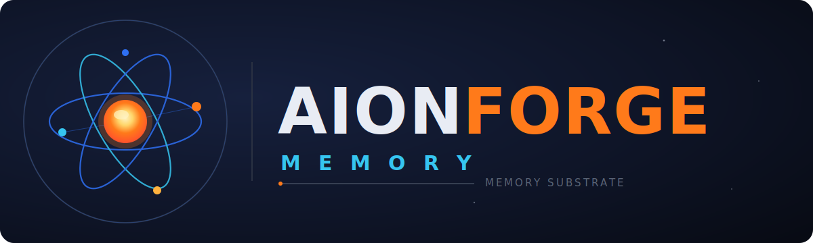

<h1 align="center">
  
</h1>

<p align="center">
  Long-term memory for AI agents, built on selene-db.
</p>

> **Status: 0.2.0 public release.** The Rust library, CLI, MCP server,
> read-only operator TUI, Docker image, and red-team gates are in place. A
> small sanitized retrieval regression corpus is in place; broader
> retrieval-quality benchmarks remain deferred. Expect schema and API changes
> before 1.0; the read-only TUI is slated to be replaced by an operator
> console in a later release.

Aionforge Memory is a Rust memory layer for agent systems. It stores episodes,
facts, notes, skills, bad patterns, work items, core memory, and audit events in
[`selene-db`](https://github.com/jscott3201/selene-db), then retrieves
relevant context with lexical anchors, vector search, graph traversal, recency,
importance, and trust signals.

Use it when an agent or a group of agents needs memory that survives across
sessions, keeps provenance, and can be searched without treating recalled text as
new instructions.

## What it does

- Captures agent observations, decisions, procedures, and failures as durable
  memory records.
- Extracts facts and entities in the background while keeping the capture path
  fast.
- Searches with BM25 lexical anchors, dense vectors, graph expansion, recency,
  importance, and trust-aware ranking.
- Preserves event time and transaction time, so corrections supersede older
  facts instead of overwriting history.
- Keeps namespace boundaries explicit: agent-private, team, global, and system
  memory are separate policy surfaces.
- Records provenance for writes, with optional signed writes, audit signing, and
  quorum-gated promotion across namespaces.
- Runs as a Rust library, a single CLI binary, or an MCP server over stdio or
  Streamable HTTP.

## Plugins and skills

The repository ships an agent plugin at
[`plugins/aionforge-memory`](plugins/aionforge-memory/README.md) that keeps memory
*in the task loop* rather than as an afterthought. It packages small, single-sourced
Agent Skills for an externally configured Aionforge Memory MCP server:

- `memory-recall` — search durable memory before planning, coding, review, or release.
- `memory-capture` — write decisions, facts, validation results, corrections, and handoffs *as they happen*.
- `work-tracking` — track tasks, blockers, TODOs, and plans as durable **work items** (`work_create` → `work_advance` → `work_link`), distinct from decaying memory episodes.
- `memory-loop` — use all of the above through a whole task: recall first, capture and track continuously, finish with a handoff.
- `memory-maintenance` — inspect backlog, audit provenance, consolidate, forget, or restore.

The skills are plain `SKILL.md` Agent Skills, so the same instructions work across
clients that support the format. **Claude Code** and **Codex** get the deepest
integration; the plugin also includes compatibility manifests for Cursor. For Claude
Code it additionally ships a default `aionforge-memory-steward` agent, the
`/aionforge-memory:memory-session` and `/aionforge-memory:memory-handoff` commands,
and a `SessionStart` hook that re-seeds the capture/work-tracking cadence into a fresh
context after a startup, resume, or context compaction.

The plugin never registers an MCP server of its own — configure the standalone
`aionforge-memory` server separately (see
[docs/mcp-clients.md](docs/mcp-clients.md)); the skills assume it exists. See the
[plugin README](plugins/aionforge-memory/README.md) for install and identity details.

## What it is not

Aionforge Memory is retrieval memory, not model training. It does not fine-tune a
model, make the model smarter, or route work across multiple model providers.
Embeddings and any optional chat/completion work are handled by thin clients
(`aionforge-embed`, `aionforge-chat`) that talk to the OpenAI-compatible
provider you configure.

Several subsystems are off by default and must be enabled per deployment:
forgetting, read-time importance decay, cross-namespace promotion, and
LLM-backed distillation. The optional LLM layers write derived, non-canonical
state and cannot change deterministic capture or recall for the same graph
state.

The honest scope boundary is documented in
[docs/honest-scope.md](docs/honest-scope.md).

## MCP surface

The MCP server supports stdio and local Streamable HTTP. Put an OAuth-aware
front end in front of HTTP before exposing it beyond loopback.

Read-like tools (allowed without a prompt):

- `search`
- `read_memory`
- `session_manifest`
- `consolidation_status`
- `audit_history`
- `server_status`
- `work_tree`
- `work_query`

Mutating tools (gated by the client approval policy):

- `capture`
- `batch_capture`
- `forget`
- `unforget`
- `pin`
- `unpin`
- `consolidate`
- `work_create`
- `work_advance`
- `work_link`

Each tool is annotated with MCP safety hints. Responses are compact receipt
lines rather than large JSON payloads. Recalled memory is wrapped in a
`<recalled-memory-context>` envelope and marked as third-party data, not
instructions.

The server also publishes client setup resources such as
`aionforge://client/claude-code/mcp.json`, with equivalents for Codex, Cursor,
and OpenCode. Plugin setup guidance is available at
`aionforge://plugin/aionforge-memory`.

## Architecture

- **Storage and search:** `selene-db` provides persistence, BM25 search, vector
  indexes, graph traversal, and graph algorithms.
- **Write path:** capture redacts secrets, removes known prompt-injection
  markers, refuses residue-only captures, deduplicates cleaned content, and
  records provenance before derived work runs.
- **Consolidation:** background passes extract facts, resolve entities,
  supersede stale facts, quarantine contradictions, distill notes, and optionally
  induce reusable skills.
- **Retrieval:** query routing chooses the relevant mix of lexical,
  lexical-anchor, dense, graph, recency, importance, and trust signals, then
  rank-fuses the results.
- **Security:** namespace authorization, signed writes, audit signing, system
  memory exclusion, untrusted recall envelopes, cross-family guards, and red-team
  probes are part of the main build and CI gates.
- **Determinism:** canonical capture, consolidation, and retrieval are
  deterministic for the same inputs and graph state. Optional LLM output stays
  outside that canonical path.

For the full subsystem map, see [docs/README.md](docs/README.md).

## Build from source

You need the Rust toolchain pinned in [rust-toolchain.toml](rust-toolchain.toml)
(Rust 1.95.0, edition 2024).

Aionforge Memory depends on the public
[`selene-db`](https://github.com/jscott3201/selene-db) substrate, consumed
from crates.io and pinned to `1.2.0`. The published crates (`selene-db-core`,
`-graph`, `-persist`, `-gql`, `-algorithms`) are aliased to stable local keys
(`selene-core`, ...) via Cargo's `package =` rename, so only `aionforge-store`
ever names them.

```bash
cargo build --workspace --locked
cargo nextest run --workspace --locked --all-features
```

To pull a newer selene-db `1.x` release, run:

```bash
cargo update -p selene-db-core -p selene-db-graph -p selene-db-persist -p selene-db-gql -p selene-db-algorithms
```

For local co-development against a sibling `selene-db` checkout, uncomment the
`[patch]` block at the bottom of [Cargo.toml](Cargo.toml) and point it at that
checkout. Do not commit the uncommented form.

Set up the shared git hooks once after cloning:

```bash
bash scripts/install-hooks.sh
```

## Run the MCP server

Start with `doctor` before exposing the server:

```bash
aionforge doctor
aionforge recover --json   # validates an existing WAL-backed store; does not create one
```

Run over stdio for a local client process:

```bash
aionforge serve stdio
```

`serve` reports the configured embedder identity to stderr at startup. When
embedding is enabled, it sends one health probe and refuses to serve if the
endpoint cannot return a vector with the configured dimension.

Run over local Streamable HTTP:

```bash
aionforge serve http --listen 127.0.0.1:3918
```

Then point your MCP client at `http://127.0.0.1:3918/mcp`. Keep the built-in
HTTP server on loopback; put a real OAuth resource-server verifier in front of
`/mcp` before exposing it to a shared network.

## Run in Docker

Published images are available from GitHub Container Registry for
`linux/amd64` and `linux/arm64`:

```bash
docker pull ghcr.io/jscott3201/aionforge-memory:0.2.0
```

Build a local image when working from source:

```bash
docker build -t aionforge-memory:dev .
docker run --rm \
  -p 127.0.0.1:3918:3918 \
  -v aionforge-data:/data \
  aionforge-memory:dev
```

On Apple silicon Macs running macOS 26, the published OCI image can run with
Apple's `container` runtime. See [Apple container](docs/apple-container.md) for
the local run helper and named-container persistence notes.

Persistent stores require an owner-only data directory on Unix. A fresh
directory is created as `0700`; an existing directory with group or other access,
or a symlink, is refused. For Docker bind mounts, make the host directory owned
by UID/GID `10001:10001` and mode `0700` before starting the container.

See [Operations and recovery](docs/operations-recovery.md) for config layering,
production signing posture, backup, volume migration, and WAL-backed recovery.

## Use the Rust library

Rust hosts can link the `aionforge` crate directly and provide an implementation
of the `Embedder` trait. The public API re-exports the `Memory` facade and the
domain types used in its signatures.

```rust
use aionforge::{CaptureRequest, Embedder, Memory, MemoryConfig, Principal, RecallQuery};

# async fn run<E: Embedder>(embedder: E) -> Result<(), Box<dyn std::error::Error>> {
let now = "2026-06-06T09:30:00-05:00[America/Chicago]".parse()?;
let memory = Memory::open_in_memory(embedder, &now, MemoryConfig::default())?;

// Fill CaptureRequest with the writer, namespace, role, and captured_at data
// your host already knows, then call memory.capture(request).await.
let viewer = Principal::agent("0197b0aa-3c5e-8000-8000-000000000001".parse()?);
let bundle = memory.search(RecallQuery::new("graph databases", viewer, 5)).await?;
println!("{}", bundle.rendered);
# Ok(())
# }
```

See [crates/aionforge/src/lib.rs](crates/aionforge/src/lib.rs) and the
integration tests under [crates/aionforge/tests/](crates/aionforge/tests/) for
complete call shapes.

## Documentation

Start with:

- [Getting started](docs/getting-started.md)
- [Embedding and provider guide](docs/embedding-guide.md)
- [Security model](docs/security-model.md)
- [MCP client support](docs/mcp-clients.md)
- [Agent plugin](docs/plugins.md)
- [Honest scope and deferred work](docs/honest-scope.md)

## Contributing

This project is public and pre-1.0. Issues and pull requests are welcome. Open
an issue before large design changes; substantial designs are explored as
RFC-style proposals first.

- **[CONTRIBUTING.md](CONTRIBUTING.md)** — setup, the branch and release model,
  the commit convention, and the gate block to run before opening a PR.
- **[AGENTS.md](AGENTS.md)** — the authoritative gate commands, crate layering,
  and core invariants for contributors and agents.
- **Bugs, features, and RFCs** — file through the issue forms in the
  [new-issue chooser](../../issues/new/choose).

Keep PR descriptions public-safe and focused on code, behavior, and validation.
The repository PR template includes a public-repo check for that reason. Do not
include private planning notes, internal handoff text, or agent transcripts in PR
bodies.

## License

Dual-licensed under either [Apache 2.0](LICENSE-APACHE) or
[MIT](LICENSE-MIT), at your option. Contributions are accepted under the same
dual license unless stated otherwise.
