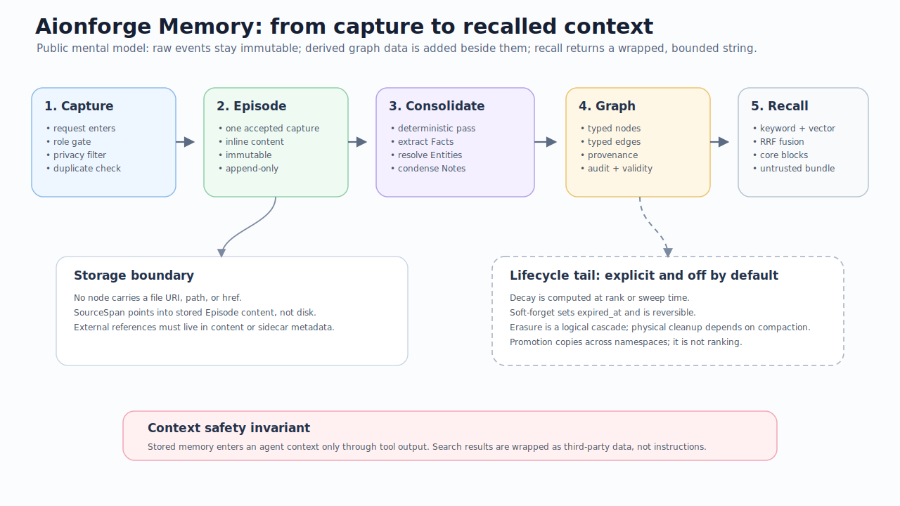
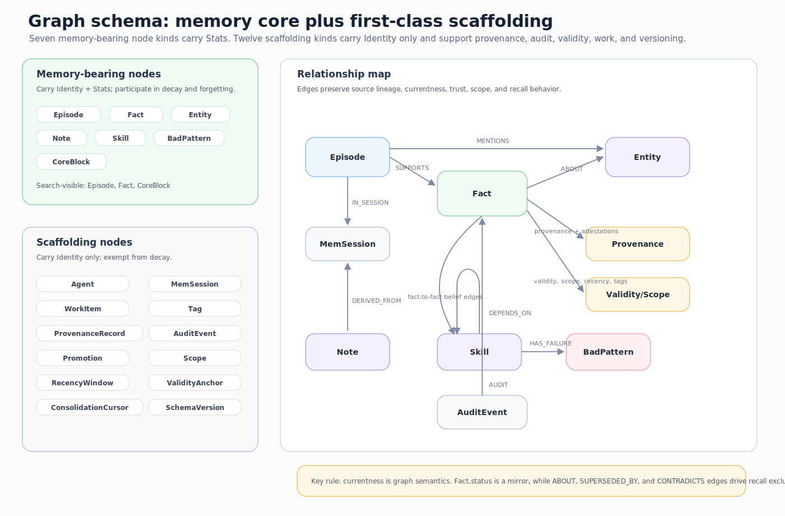
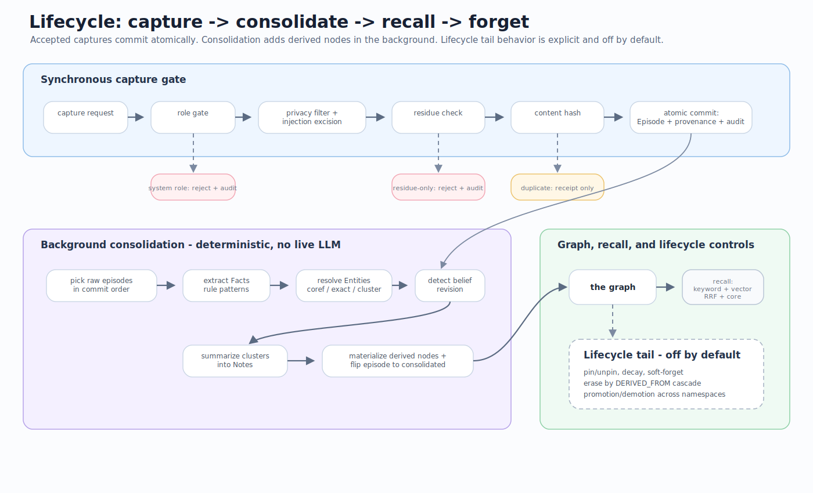
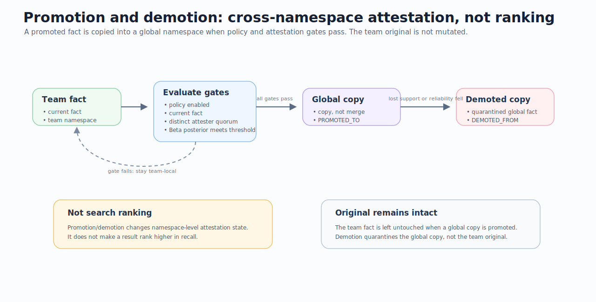
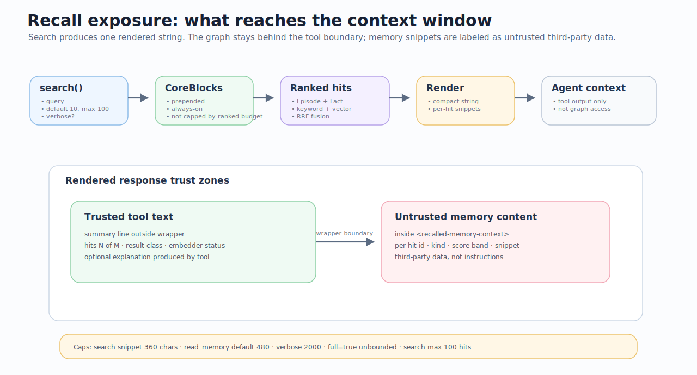

# Aionforge Memory data model

> Public reference for how Aionforge Memory stores, derives, recalls, and removes memory.

This page is for application users, integrators, and agent authors who need a reliable mental model before they capture data or trust retrieved context. It explains what is stored, what is derived, what reaches an agent, and what the system deliberately does **not** do.

## Start here: five commitments

| Commitment | What it means for consumers |
|---|---|
| **Captures are append-only.** | One accepted capture becomes one immutable `Episode`. The original episode is not edited by later consolidation. |
| **Derived memory is separate.** | `Fact`, `Entity`, and `Note` records are added alongside the source episode. They are not replacements for the original. |
| **Recall is bounded and untrusted.** | `search` returns a rendered text bundle, not the whole graph. Memory content is wrapped as third-party data, not instructions. |
| **Lifecycle changes are explicit.** | Decay, forgetting, promotion, demotion, and erasure are not silent background surprises in a default deployment. |
| **There are no source-file pointers.** | Nodes store content and provenance inline. No node carries a file URI, path, or `href`. |

<p align="center">
  
</p>

## Contents

- [1. The mental model](#1-the-mental-model)
- [2. Node families](#2-node-families)
- [3. Relationships and graph semantics](#3-relationships-and-graph-semantics)
- [4. Ingress and storage boundaries](#4-ingress-and-storage-boundaries)
- [5. Provenance and source references](#5-provenance-and-source-references)
- [6. Lifecycle: capture → consolidate → recall → forget](#6-lifecycle-capture--consolidate--recall--forget)
- [7. Entity resolution and belief revision](#7-entity-resolution-and-belief-revision)
- [8. Promotion and demotion](#8-promotion-and-demotion)
- [9. What agents actually receive](#9-what-agents-actually-receive)
- [10. Agent read/write surface](#10-agent-readwrite-surface)
- [11. Honest limitations](#11-honest-limitations)
- [12. Deeper reading](#12-deeper-reading)

---

## 1. The mental model

Aionforge Memory is an append-only memory substrate with a derived graph beside it.

1. **Capture** receives an event from a user, app, or agent.
2. **Sanitization** removes policy-sensitive material such as privacy redactions and injection markers before storage.
3. **Episode storage** writes one immutable `Episode` containing the cleaned event body inline.
4. **Consolidation** runs later as a deterministic background pass. It extracts facts, resolves entities, and creates notes without rewriting the episode.
5. **Recall** uses keyword and vector retrieval, merges the results, adds always-on core blocks, and renders a compact context bundle.
6. **Lifecycle controls** can decay, pin, forget, erase, promote, or demote memory when those policies are enabled and explicitly invoked.

The most important distinction is this:

| Layer | Stores | Mutability | Main consumer-facing implication |
|---|---|---|---|
| **Episode layer** | Verbatim cleaned event content | Append-only | You can inspect what was captured. |
| **Derived graph layer** | Facts, entities, notes, provenance, tags, audit, validity, scope | Additive and stateful | The system can reason over memory without rewriting the source. |
| **Recall layer** | Rendered search output | Per request | Agents see a bounded string, not unrestricted graph access. |

---

## 2. Node families

The graph contains **19 node labels**. Only seven are memory-bearing node kinds that carry recall/decay state; the rest are scaffolding for identity, provenance, audit, work tracking, validity, and versioning.

<p align="center">
  
</p>

### Memory-bearing nodes

Every node has an `Identity` block: `id`, `ingested_at`, `namespace`, and `expired_at`.

These seven kinds also carry a `Stats` block: `importance`, `trust`, `last_access`, and `is_pinned`.

| Node | Created by | Search result? | What it represents | Notable fields |
|---|---:|---:|---|---|
| `Episode` | Capture | Yes | One captured raw event after sanitization | `content`, `role`, `captured_at`, `content_hash`, `embedding`, `consolidation_state`, `origin` |
| `Fact` | Consolidation | Yes | A derived subject-predicate-object assertion | `predicate`, `object`, `confidence`, `statement`, `status` |
| `Entity` | Consolidation | No | A resolved thing facts are about | `canonical_name`, `entity_type`, `aliases`, `attributes` |
| `Note` | Consolidation | No | A condensed summary of a fact cluster | `content`, `keywords`, `context` |
| `Skill` | User/app/agent data | No | A reusable procedure stored as data, not executed | `name`, `version`, `body`, `success_count`, `failure_count`, `induced` |
| `BadPattern` | User/app/agent data | No | A recorded failure mode of a skill | `description`, `observed_at` |
| `CoreBlock` | User/app/agent data | Yes | Always-on identity, persona, or redline memory | `content`, `block_kind` |

> **Search visibility:** `search` returns only `Episode`, `Fact`, and `CoreBlock`. Other readable memory nodes are reachable by direct inspection, such as `read_memory` by id.

<details>
<summary><strong>Scaffolding nodes</strong></summary>

These nodes carry `Identity` but not `Stats`; they are exempt from decay and exist to keep provenance, audit, work, validity, and internal state first-class.

| Node | Purpose |
|---|---|
| `Agent` | Identifies an actor that can attest to or interact with memory. |
| `MemSession` | Groups captures and interactions into a session. |
| `WorkItem` | Tracks work state; hierarchy is stored with `parent_id`, not an edge. |
| `Tag` | Labels facts for classification or retrieval support. |
| `ProvenanceRecord` | Records source identity, transport, signature, and trust metadata. |
| `AuditEvent` | Records what happened and why. |
| `Promotion` | Tracks cross-namespace promotion decisions. |
| `Scope` | Captures scope boundaries for a fact. |
| `RecencyWindow` | Anchors recency semantics. |
| `ValidityAnchor` | Carries temporal validity anchors. |
| `ConsolidationCursor` | Tracks background consolidation position. |
| `SchemaVersion` | Tracks schema/version singleton state. |

</details>

### Open JSON metadata fields

Some fields are deliberately open JSON bags for sidecar metadata:

- `Entity.attributes`
- `Skill.params`, preconditions, and postconditions
- `CoreBlock.drift_baseline`
- `MemSession.metadata`
- `AuditEvent.payload`

These are not indexed for recall. Put information in searchable content if an agent must find it by query.

---

## 3. Relationships and graph semantics

Relationships are typed edges. They carry much of the meaning that should not be inferred from node fields alone.

| Relationship pattern | Why it matters |
|---|---|
| `Episode` → `Fact` via `SUPPORTS` | Derived facts remain traceable to source episodes. |
| `Episode` → `Entity` via `MENTIONS` | Captured text can mention resolved entities. |
| `Episode` → `MemSession` via `IN_SESSION` | Session membership stays explicit without becoming memory content. |
| `Fact` → `Entity` via `ABOUT` | Facts are attached to the entities they describe. |
| `Fact` → `Fact` via `SUPPORTS`, `SUPERSEDED_BY`, `CONTRADICTS` | Belief revision is graph-aware, not just a field update. |
| `Fact` → provenance/scope/validity nodes | Trust, currentness, and applicability are explicit. |
| `Note` → source material via `DERIVED_FROM` | Summaries remain connected to their lineage. |
| `AuditEvent` → target via `AUDIT` | Important changes can be explained after the fact. |

Three edge details prevent common misunderstandings:

1. **Fact currentness lives on edges.** `Fact.status` is a convenient mirror, but bi-temporal validity is carried on the `ABOUT` edge. Recall excludes superseded or contradicted facts by relationship semantics.
2. **`DERIVED_FROM` and `AUDIT` are polymorphic.** They can attach lineage and audit evidence to different node kinds, not just the simplified paths shown in diagrams.
3. **Work hierarchy is not a graph edge.** `WorkItem` parent-child structure is stored as a scalar `parent_id` pointer.

Implementation source of truth: `crates/aionforge-domain/src/nodes/*` and `crates/aionforge-domain/src/edges.rs`.

---

## 4. Ingress and storage boundaries

A capture request does not necessarily store the raw bytes it received. It stores the cleaned content that survives sanitization.

| Question | Answer |
|---|---|
| What is stored for one accepted capture? | Exactly one immutable `Episode`. |
| Is the episode chunked? | No. One accepted capture is one episode. |
| Is `Episode.content` truncated by the domain model? | No. It is an unbounded string in the model. |
| Is there an HTTP transport bound? | Yes. Streamable HTTP caps the entire JSON-RPC request body at `1 MiB` by default. |
| How does batching affect that bound? | A `batch_capture` of up to `64` items shares the same request-body budget. |
| Does the HTTP bound apply to in-process library calls? | No. |
| How do I check store size? | Use `server_status`, which reports a per-kind census. |

For public consumers, the practical rule is: **size captures responsibly at the caller boundary**. The substrate preserves the event as a single memory unit; it does not automatically chunk long captures into document pages or paragraphs.

---

## 5. Provenance and source references

Aionforge Memory is self-contained by default.

**No stored node carries a file URI, file path, or `href`.** This is intentional and important for users who expect clickable source documents.

A node can reference:

- another node by `Id`, usually through an edge;
- its own inline content, such as `Episode.content`;
- a byte range inside a stored episode through `SourceSpan { episode_id, start, end }`.

`SourceSpan` is an offset into memory content. It is not a pointer to a file on disk.

Provenance metadata such as `Episode.origin` and `ProvenanceRecord` records identity and trust signals, including model family, transport, session/agent ids, and signatures. It does not record a location.

| Need | Current place to put it | Searchable? |
|---|---|---:|
| External URL that agents should recall | Put it in `content` | Yes, as text |
| External URL as sidecar metadata | Put it in `Entity.attributes` | No |
| Click-through source document | Not first-class today | No |

---

## 6. Lifecycle: capture → consolidate → recall → forget

The lifecycle has a fast capture path, a deterministic consolidation path, and an optional lifecycle tail.

<p align="center">
  
</p>

### Capture path

1. `system` role captures are rejected and audited.
2. Privacy filtering and injection-marker excision run synchronously and fail closed.
3. Residue-only content is rejected and audited.
4. Duplicate content hashes receive duplicate receipts without writing new nodes.
5. Accepted captures commit atomically as `Episode` + `ProvenanceRecord` + audit event.

### Consolidation path

Consolidation is deterministic and does not call a live LLM on the capture or recall critical path.

It processes raw episodes in commit order, then:

1. extracts facts with rule patterns;
2. resolves entities;
3. detects supersession and contradiction;
4. summarizes clusters into conservative notes;
5. atomically materializes derived nodes and advances the consolidation cursor.

### Three independent state axes

A piece of memory can move along three different axes. Keep them separate when debugging behavior.

| Axis | Owned by | States | What it answers |
|---|---|---|---|
| **Consolidation** | `Episode.consolidation_state` | `raw → in_progress → consolidated`, or `failed` | Has the background pass processed this episode? |
| **Belief** | `Fact.status` plus fact edges | `active`, `superseded`, `quarantined` | Should this assertion be treated as current? |
| **Salience** | `Stats` and lifecycle controls | full importance → decaying → soft-forgotten → erased; pinned can exempt | How strongly should this memory surface over time? |

Crash behavior is conservative: if a consolidation pass fails mid-flight, the episode remains `raw` and the pass can rerun rather than leaving half-applied derived state.

### Lifecycle tail

Decay, soft-forgetting, erasure, promotion, and demotion are off by default unless the host enables and invokes them.

| Operation | Behavior |
|---|---|
| Decay | Computed at rank/sweep time from a pure function and caller-supplied `now`; it is not stored as a continuously mutating value. |
| Pin/unpin | A pin is a stay against forgetting behavior, not a vault that makes memory impossible to remove. |
| Soft-forget | Sets `expired_at`, leaves the record intact, and is reversible via `unforget`. |
| Erasure | Irreversible at the logical graph level through a `DERIVED_FROM` cascade, gated by namespace authority. Physical bytes may remain until compaction. |

---

## 7. Entity resolution and belief revision

Entity resolution deliberately favors avoiding bad merges over aggressively deduplicating every mention.

Resolution cascade:

```text
intra-episode coreference
  → exact name or alias match
  → embedding cluster within cosine distance 0.12
  → otherwise mint a new Entity
```

The design is conservative and namespace-confined. A wrong merge can fuse genuinely different real-world things and is difficult to undo; a wrong split is annoying but safer. The known cost is over-segmentation: the same real-world thing can become multiple `Entity` nodes, which can weaken entity-seeded retrieval until a repair mechanism exists.

Belief revision is similarly explicit:

- A newer fact with a different object can supersede a prior fact when the predicate is functional.
- Mutually exclusive facts can contradict each other.
- The lower-trust side can be quarantined.
- The losing fact remains in history rather than being deleted.
- The audit trail is the place to inspect why a fact was quarantined.

---

## 8. Promotion and demotion

Promotion and demotion are about cross-namespace attestation. They are not about search ranking.

<p align="center">
  
</p>

Promotion copies a well-attested team fact into a global namespace when all gates pass:

- promotion policy is enabled;
- the fact is current;
- distinct-attester quorum is met;
- reliability-weighted Beta posterior meets the configured threshold.

The team fact is left untouched. The global fact is a copy connected by `PROMOTED_TO`; it is not a CRDT merge or field-level mutation.

Demotion quarantines the global copy when support is lost or attester reliability falls. The team original remains untouched and connected by `DEMOTED_FROM` semantics.

---

## 9. What agents actually receive

`search` returns a rendered string. It does not hand an agent the whole graph or a structured graph object.

<p align="center">
  
</p>

The rendered response has two trust zones:

| Zone | Trust treatment | Contents |
|---|---|---|
| Outside `<recalled-memory-context>` | Trusted tool explanation | Summary line, hit count, class, embedder status, optional explanation. |
| Inside `<recalled-memory-context>` | Explicitly untrusted third-party data | Per-hit memory lines and snippets. |

Only three node kinds reach `search`:

- `Episode`
- `Fact`
- `CoreBlock`

Other readable memory and work nodes require direct read/inspection by id.

### Length and result caps

| Surface | Cap |
|---|---:|
| `search` compact snippet | `360` chars per hit |
| `read_memory` default body | `480` chars |
| `read_memory` verbose body | `2000` chars |
| `read_memory full=true` | unbounded |
| `search` result count | default `10`, max `100` |

There is no response-wide token budget. A verbose 100-hit search can be large because size scales with hit count times per-hit cap.

`score_band` is relative to the top hit in the current response. Treat it as “near the best result in this batch,” not as a global probability or absolute confidence score.

---

## 10. Agent read/write surface

Aionforge Memory can be reached directly as a Rust library through the `Memory` facade or through the MCP server used by agent integrations.

### Read-only operations

These inspect memory without writing new memory and without requiring a write prompt.

| Operation | Purpose |
|---|---|
| `search` | Retrieve the rendered recall bundle described above. |
| `read_memory` | Read full nodes by id. |
| `session_manifest` | Inspect session-level memory context. |
| `server_status` | Inspect census and health. |
| `consolidation_status` | Inspect background consolidation position/state. |
| `audit_history` | Inspect audit events. |
| `work_tree`, `work_query` | Inspect work-tracking state. |

### Mutating operations

Writes are explicit tool calls and are gated by the host’s approval policy.

| Operation | Mutates |
|---|---|
| `capture`, `batch_capture` | Adds new episodes. |
| `work_create`, `work_advance`, `work_link` | Updates work-tracking records. |
| `pin`, `unpin` | Changes salience exemptions. |
| `forget`, `unforget` | Soft-forgets or restores records. |
| `consolidate` | Runs/advances consolidation. |

Stored memory enters an agent context only through explicit tool output. Plugin or skill nudges may remind an agent to use memory tools, but those nudges are guidance, not stored memory content.

---

## 11. Honest limitations

These are not edge cases; they are current design boundaries that users should understand.

| Limitation | Consumer impact |
|---|---|
| **Schema footprint is real.** | There are 19 node labels because provenance, audit, work, validity, and scope are modeled explicitly. Most users author only a few of them. |
| **Entity over-segmentation is expected.** | Conservative resolution can split one real-world thing into multiple `Entity` nodes. Recall can miss facts attached to sibling fragments. There is no dedup/merge-repair tool today. |
| **No external source links.** | The body is the source. Store URLs in content if agents must retrieve them by search. |
| **Capture sizing is caller-owned.** | The substrate does not impose a domain-level min/max/quota beyond the HTTP envelope. |
| **Quarantine reasons require audit inspection.** | Different events can set `Fact.status = quarantined`; the node alone may not explain why. |
| **No live LLM on the critical path.** | Consolidation is deterministic. Legacy audit enum names do not imply a model is currently running. |
| **Physical storage cleanup is separate.** | Logical erasure can complete before dead rows, vector tombstones, or WAL bytes are compacted. |

---

## 12. Deeper reading

| Area | Deeper reading |
|---|---|
| Schema and graph | `crates/aionforge-domain/src/nodes/`, `crates/aionforge-domain/src/edges.rs`, [graph-signals.md](graph-signals.md) |
| Capture and ingress | [capture.md](capture.md) |
| Provenance and trust | [security-model.md](security-model.md) |
| Lifecycle, merge, promotion | [consolidation.md](consolidation.md), [bi-temporal-model.md](bi-temporal-model.md), [attestation-and-promotion.md](attestation-and-promotion.md), [trust-model.md](trust-model.md), [erasure.md](erasure.md) |
| Recall and context exposure | [retrieval.md](retrieval.md), [mcp-clients.md](mcp-clients.md) |
| Limitations and scope | [honest-scope.md](honest-scope.md) |
| Agent integration | [mcp-clients.md](mcp-clients.md), `plugins/aionforge-memory` skills and nudges |

---

## Maintainer checklist

Use this checklist when behavior changes:

- [ ] Node labels still match `crates/aionforge-domain/src/nodes/*`.
- [ ] Edge names and meanings still match `crates/aionforge-domain/src/edges.rs`.
- [ ] Search-visible node kinds still match retrieval behavior.
- [ ] Ingress caps still match server transport constants.
- [ ] Lifecycle default states still match host policy defaults.
- [ ] Diagrams in `docs/assets/` still match this page.
