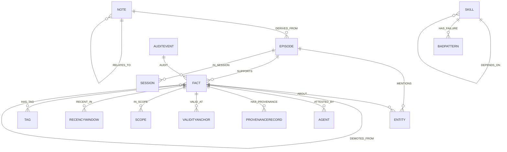
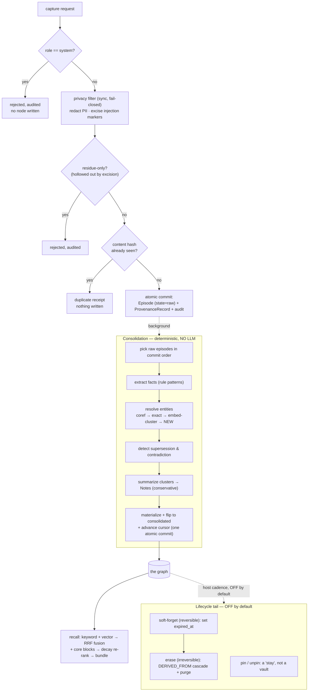
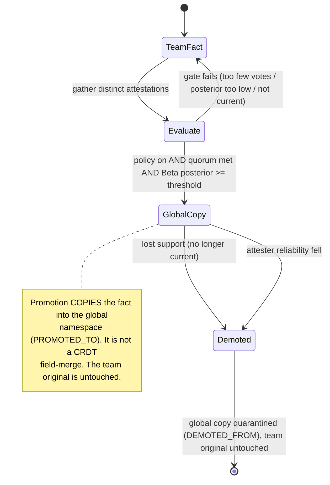
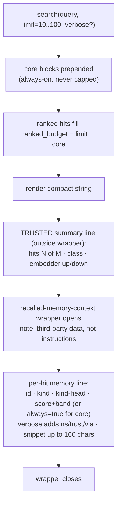

# Data model and mental model — how your information is stored, derived, and surfaced

This is the front-door reference for what Aionforge Memory actually *does* with the
information you give it. Most docs here explain one subsystem deeply; this one stitches
them together and states the things no single doc states outright — including the
absences (no file URIs, no size cap) a careful reader needs to know before capturing
anything.

If you read one page first, read this one.

---

## 1. The 60-second mental model

- You **capture** raw events. Each becomes one **immutable, append-only `Episode`** — the
  verbatim record, stored inline.
- A **deterministic background pass** (no LLM — see §5) reads consolidated episodes and
  derives **`Fact`s**, resolves **`Entity`s**, and condenses **`Note`s**. It never edits
  an episode; it adds derived nodes and edges alongside it.
- When an agent **recalls**, the system fuses keyword + vector search and hands back a
  **tagged, truncated, explicitly-untrusted** text bundle — not the whole graph.
- The **lifecycle tail** (decay, forgetting, cross-namespace promotion, erasure) is
  **mostly off by default**. A default deployment captures and recalls; it does not
  silently forget, promote, or rewrite.
- The store is **self-contained**: a node's content lives *inside* the node. There are
  **no pointers to external files** (see §4).

The rest of this page is the detail behind each of those sentences.

---

## 2. The schema — nodes, fields, and edges

Your information is schematized into a small set of typed nodes connected by typed edges.
There are **19 node labels**, but you only ever author a few of them; the rest are
control, provenance, and bookkeeping scaffolding the substrate manages for you.

### The 7 "retrievable" kinds (the ones that carry decay state)

Only these carry a `Stats` block (`importance`, `trust`, `last_access`, `is_pinned`) and
participate in decay/forgetting. Every node also carries an `Identity` block
(`id`, `ingested_at`, `namespace`, `expired_at`).

| Node | What it is | Notable fields |
|------|------------|----------------|
| `Episode` | One captured raw event (immutable) | `content` (verbatim, **unbounded** — see §3), `role`, `captured_at`, `content_hash`, `embedding`, `consolidation_state`, `origin` |
| `Fact` | A derived `subject–predicate–object` assertion | `predicate`, `object`, `confidence`, `statement` (NL recall surface), `status` |
| `Entity` | A resolved thing facts are about | `canonical_name`, `entity_type`, `aliases`, `attributes` (open JSON) |
| `Note` | A condensed summary of a fact cluster | `content`, `keywords`, `context` |
| `Skill` | A reusable procedure (stored as data, never executed) | `name`, `version`, `body`, `success_count`/`failure_count`, `induced` |
| `BadPattern` | A recorded failure mode of a skill | `description`, `observed_at` |
| `CoreBlock` | Always-on identity/persona/redline memory | `content`, `block_kind` |

### The 12 scaffolding kinds (you don't author these)

`Agent`, `Session`, `WorkItem`, `Tag`, `ProvenanceRecord`, `AuditEvent`, `Promotion`,
`Scope`, `RecencyWindow`, `ValidityAnchor`, `ConsolidationCursor`, `SchemaVersion`.

These carry `Identity` only (no `Stats`) and are **exempt from decay**. They record *who*
wrote things, *what happened* (the signed audit trail), work-item tracking, and internal
position/version singletons.

### Open metadata fields (the JSON bags)

A few fields are deliberately open `JSON` bags — extra, free-form per-node metadata:
`Entity.attributes`, `Skill.params`/pre/post-conditions, `CoreBlock.drift_baseline`,
`Session.metadata`, `AuditEvent.payload`. These are **not indexed for recall** — they are
sidecar metadata, not searchable content.

### The edges (19 types)

Two things worth knowing:

- **`Fact` currentness lives on edges, not the node.** A fact's bi-temporal validity is
  carried on its `ABOUT` edge; `Fact.status` is a convenience mirror. Supersession and
  contradiction are *edges* (`SUPERSEDED_BY`, `CONTRADICTS`) — recall excludes by edge,
  not by reading a status flag.
- **`DERIVED_FROM` and `AUDIT` are polymorphic** (any→any), which is how the erasure
  cascade and the audit trail attach to anything.
- **Work-item hierarchy is *not* an edge** — it's a scalar `parent_id` pointer on the
  `WorkItem` node.

Source of truth: `crates/aionforge-domain/src/nodes/*` and `edges.rs`.

---

## 3. Ingress — what enters a node, and how much

**One capture request → exactly one immutable `Episode`.** What gets stored is the
**cleaned** content (after privacy redaction and injection-marker excision — see
[capture.md](capture.md)), not necessarily the raw bytes you sent.

**How much can one node hold?** There is **no size cap, no truncation, and no chunking**
on `Episode.content` anywhere in the domain, capture, engine, or store layers — it is an
unbounded string. One capture is one node regardless of length. The substrate trusts you
to size your captures sensibly.

The **only** byte bound on the whole ingress path is at the HTTP transport edge: the
Streamable-HTTP request body is capped at **1 MiB** (`DEFAULT_MAX_REQUEST_BODY_BYTES`).
That bounds the *entire* JSON-RPC envelope — so a `batch_capture` of up to **64** items
(`MAX_BATCH_ITEMS`) shares that one budget — and it does **not** apply to the in-process
library path at all.

**How much is in my store overall?** The only built-in gauge is `server_status`, which
reports a per-kind census (`episodes`, `facts`, `entities`, `notes`, … and `work_items`).
That is your capacity lens.

---

## 4. Provenance and the no-URI reality

**No node carries a file URI, path, or `href`.** If you were expecting "click through to
the source document," there is none, and this doc is the one that says so plainly.

The system is self-contained. A node references:

- **other nodes**, by `Id` (via edges like `DERIVED_FROM`, `MENTIONS`, `HAS_PROVENANCE`);
- **its own content**, inline — the full event body lives in `Episode.content`;
- a byte range *within a sibling episode* via `SourceSpan { episode_id, start, end }` —
  this is an offset into stored content, **not** a pointer to a file on disk.

Provenance metadata (`Episode.origin`, `ProvenanceRecord`) records `model_family`,
transport, session/agent ids, and a signature — identity and trust, never a location.

If you need an external reference (a URL, a file path), today the only place to put it is
**free text inside `content`** or the **unindexed `Entity.attributes`** JSON bag. There is
no first-class "source link" field. (The only `aionforge://` URIs in the system are
**MCP resource** URIs — server docs — not stored-memory sources.)

---

## 5. The lifecycle — capture → consolidate → recall → forget

### Three independent state axes

A piece of memory moves along three *orthogonal* axes, each owned by a different mechanism:

1. **Consolidation** (`Episode.consolidation_state`): `raw → in_progress → consolidated`
   (or `failed`). A crash mid-pass leaves the episode `raw` and the whole pass re-runs —
   never half-applied.
2. **Belief** (`Fact.status`): `active`, `superseded`, or `quarantined`. A newer fact with
   a different object **supersedes** the prior (functional predicates only); two
   mutually-exclusive facts **contradict** and the lower-trust side is quarantined. **The
   loser is retained in history, never deleted.**
3. **Salience** (the `Stats` block): full-importance → decaying → soft-forgotten → erased,
   with **pinned** as an exemption.

### Collation and merging — and why it leans toward *splitting*

Entity resolution maps each surface form to a canonical entity through a cascade:
intra-episode coreference → exact name/alias match → embedding cluster within cosine
distance `0.12` → **otherwise mint a new entity**. This is deliberately **conservative
(split-leaning)**: a wrong *merge* fuses two genuinely different things and is far harder
to undo than a wrong *split*. Resolution is also **namespace-confined** — there is no
global entity pool — as a subliminal-trait safety boundary.

The cost of that choice is real and called out in §7.

### Promotion and demotion (off by default, and *not* about ranking)

> ⚠️ "Promotion/demotion" here means **cross-namespace attestation** — copying a
> well-attested team fact up into the global namespace. It is **not** the same thing as a
> recall result "ranking higher." Those are unrelated mechanisms; see
> [retrieval.md](retrieval.md) for rank ordering.

Promotion requires the policy to be **enabled** (off by default), the fact to be current,
a quorum of distinct attestations, and a reliability-weighted Beta posterior over a
threshold. The two demotion triggers are exact complements, so a promoted fact is never
double-demoted.

### Decay, forgetting, erasure (all off by default)

- **Decay is never stored.** Importance decay is computed at rank/sweep time from a pure
  function with a caller-supplied "now"; if you don't stamp a time, re-ranking is skipped.
- **Forgetting is spare-only and reversible.** The forget sweep is a strict-AND over
  several axes that can only *spare* a memory; exemptions (pinned, lineage-bearing,
  attested, protected kinds) are checked first. Soft-forget sets `expired_at`, leaves the
  record intact, and is reversible via `unforget`.
- **Erasure is an irreversible cascade** over the `DERIVED_FROM` closure, gated by
  per-namespace authority. Note that "irreversible" is *logical*: physical bytes (dead
  rows, vector tombstones, WAL) persist until compaction, which has no scheduled eviction
  yet. See [erasure.md](erasure.md).

---

## 6. What lands on your context window (recall exposure)

When an agent calls `search`, it receives a single **rendered string** (not a structured
object), shaped like this:

Key facts to set expectations:

- **The bundle is explicitly untrusted.** Everything inside `<recalled-memory-context>` is
  wrapped and tagged as third-party data, not instructions. The summary/explain lines
  *outside* the wrapper are the only trusted text.
- **Only 3 of the 7 retrievable kinds reach `search`:** `Episode`, `Fact`, and `CoreBlock`.
  `Entity`, `Note`, `Skill`, `BadPattern`, `WorkItem`, and `Tag` are reachable **only by
  `read_memory` by id**, never via search.
- **Per-hit length caps** (no aggregate token budget — bounding is per-hit × count):

  | Surface | Cap |
  |---------|-----|
  | `search` compact snippet | **160** chars |
  | `read_memory` default body | **240** chars |
  | `read_memory` verbose body | **2000** chars |
  | `read_memory` `full=true` | **unbounded** |
  | `search` results | default **10**, max **100** |

- **`score_band` is relative to *this* response's top hit**, not a global confidence —
  treat it as "near the best in this batch," not a probability.
- A 100-hit verbose search can be large. There is no response-wide token cap; size scales
  with hit count × per-hit cap.

See [retrieval.md](retrieval.md) and [mcp-clients.md](mcp-clients.md) for the surrounding
mechanics.

---

## 7. Honest limitations and known sprawl

The limitations worth knowing before you rely on this in production — stated plainly:

- **Schema sprawl is real.** 19 node labels across 7 families; ~12 are scaffolding you
  never author. The footprint looks heavy because provenance, audit, work-tracking, and
  bi-temporal anchoring are all first-class nodes. Only 7 kinds are decaying memory.
- **Entity over-segmentation is the *expected* failure mode, not a bug.** Because
  resolution is conservatively new-by-default and namespace-confined, the same real-world
  thing can fragment into duplicate `Entity` nodes. That dilutes the high-precision
  entity-seed retrieval path and PageRank seeds, and recall of a fragmented entity can
  miss facts attached to a sibling fragment. **There is no dedup/merge-repair tool today.**
- **No external references.** No node points at a source file/URL (see §4); the body is
  the source.
- **Capture is policy-free at the substrate.** No min/max/quota on content size beyond the
  1 MiB HTTP envelope; the caller owns sizing.
- **Belief-revision producers look alike at the node level.** Several different
  events (contradiction, lost-support demotion, reliability demotion) all set a fact to
  `quarantined`; only the **audit trail** distinguishes *why*.
- **Consolidation is fully deterministic — there is no live LLM** anywhere on the capture
  or recall critical path. (The `AuditKind::Distill` audit variant is a retained-but-never-
  emitted decode tombstone from a removed experiment; seeing it in the enum does not mean a
  model runs.)
- **The lifecycle tail is off by default**, and erasure is *logically* irreversible while
  physical bytes persist until a compaction that isn't scheduled yet.

See [honest-scope.md](honest-scope.md) for the canonical limitations list.

---

## 8. How an agent reads, writes, and gets context

Aionforge Memory is reached two ways: directly as a **Rust library** (the `Memory` facade),
or — for agents — over the **MCP server**, usually wired up by the **plugins/skills** layer.
This section orients that agent-facing surface: what an agent *reads*, what it *writes*, and
what actually reaches its context window.

**What an agent reads (read-only).** Recall and inspection never mutate, and run without a
write prompt: `search` (the recall bundle of §6), `read_memory` (full nodes by id),
`session_manifest`, `server_status` (the census/health of §3), `consolidation_status`,
`audit_history`, and the work-tracking reads (`work_tree`, `work_query`).

**What an agent writes (mutating, gated).** Writes are explicit and, by default, **gated on
user approval**: `capture` / `batch_capture` (new episodes), the work-item mutators
(`work_create`, `work_advance`, `work_link`), and the lifecycle controls (`pin` / `unpin`,
`forget` / `unforget`, `consolidate`). Nothing rewrites your memory silently — every write is
a visible tool call you can gate.

**What reaches the context window.** Only what a tool call returns. The recall bundle (§6)
arrives **wrapped and tagged as untrusted third-party data**, never as instructions. The one
thing a host may inject on its own is the **plugins/skills nudge** — the
`plugins/aionforge-memory` skills (recall-before-work, capture-as-you-go, work-tracking) and
its SessionStart hook inject *guidance to use the tools*, not memory content. Stored memory
enters context only through an explicit read.

### Doc map

This page is the hub; each subsystem doc is a spoke.

| Area | Deeper reading |
|------|----------------|
| Schema & graph (§2) | `crates/aionforge-domain/src/nodes/`, [graph-signals.md](graph-signals.md) |
| Capture & ingress (§3) | [capture.md](capture.md) |
| Provenance & trust (§4) | [security-model.md](security-model.md) |
| Lifecycle, merge, promotion (§5) | [consolidation.md](consolidation.md), [bi-temporal-model.md](bi-temporal-model.md), [attestation-and-promotion.md](attestation-and-promotion.md), [trust-model.md](trust-model.md), [erasure.md](erasure.md) |
| Recall & context exposure (§6) | [retrieval.md](retrieval.md), [mcp-clients.md](mcp-clients.md) |
| Limitations & scope (§7) | [honest-scope.md](honest-scope.md) |
| Agent integration | [mcp-clients.md](mcp-clients.md), the `plugins/aionforge-memory` skills & nudges |
